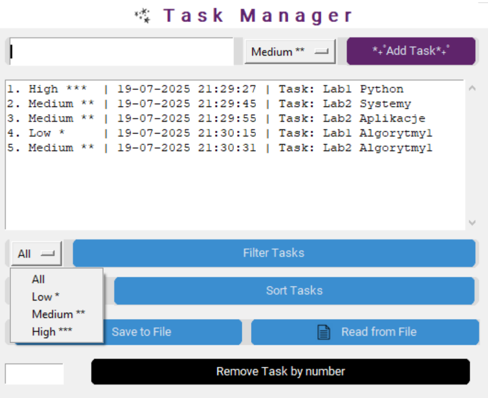

# Task Manager - Graphical Task Manager
This application allows you to add tasks with priority, filter, sort, and delete them, as well as save and load the task list from a text file.

**A Python final project** at the West Pomeranian University of Technology in the 2023/2024 academic year.

## Author
Martyna Kowieska

## Features
- Simple graphical interface with buttons and drop-down menus.
- Add a task with a selected priority (Low, Medium, High).
- Automatically assign a timestamp (dd-mm-YYYY HH:MM:SS).
- Display a list of numbered tasks.
- Filter tasks by priority (All / Low / Medium / High).
- Sort tasks by time added or priority.
- Delete a task by number from the list.
- Save all tasks to a text file.
- Reading tasks from a file and restoring the list.

## Technologies
| Technology | Applications |
|:---------------:|:------------------------------------------------:|
| Python (3.9.13) | Application logic |
| tkinter | Basic GUI |
| customtkinter | Improved widget appearance |
| Pillow (PIL) | Loading and resizing images (logos/icons) |

## Installation and Launch
1. Clone the repository:
   ```bash
      git clone https://github.com/mkowieska/Python_1
      cd repository-name
   ```

## Application Appearance
1. Start Panel


2. Prioritization


3. Filtering




4. Sorting


5. Saving to File


6. Deleting


## File Structure
```text
Python_1/
│
├─ Task.py                 # Task and TaskManager class definitions
├─ main.py                 # Main application entry point
├─ images/                 # Directory for images (logos, icons)
│ ├─ img_star.jpg
│ ├─ img_save.jpg
│ └─ img_read.jpg
├─ screenshots/            # Task manager screenshots
│ ├─ before_deleting.png
│ ├─ deleting.png
│ ├─ filters.png
│ ├─ filters_medium.png
│ ├─ priorities.png
│ ├─ save_to_file.png
│ ├─ sorting.png
│ └─ task_manager.png
├─ laboratories/           # Files from laboratory exercises
│ ├─ lab1-Python.py
│ ├─ lab2-Python.py
│ ├─ lab3-Python.py
│ ├─ lab4-Python.py
│ ├─ lab5-Python.py
│ ├─ lab6-Python.py
│ └─ lab7-Python.py
└─ README.md
```