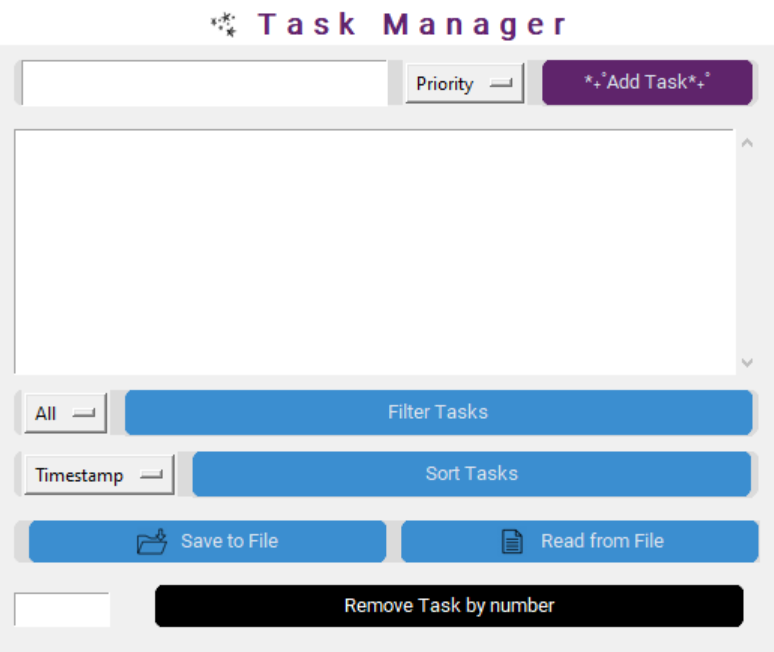
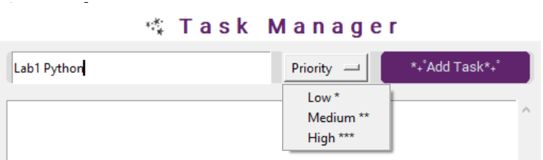
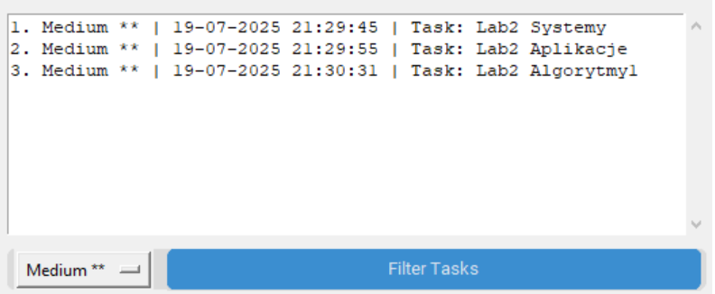
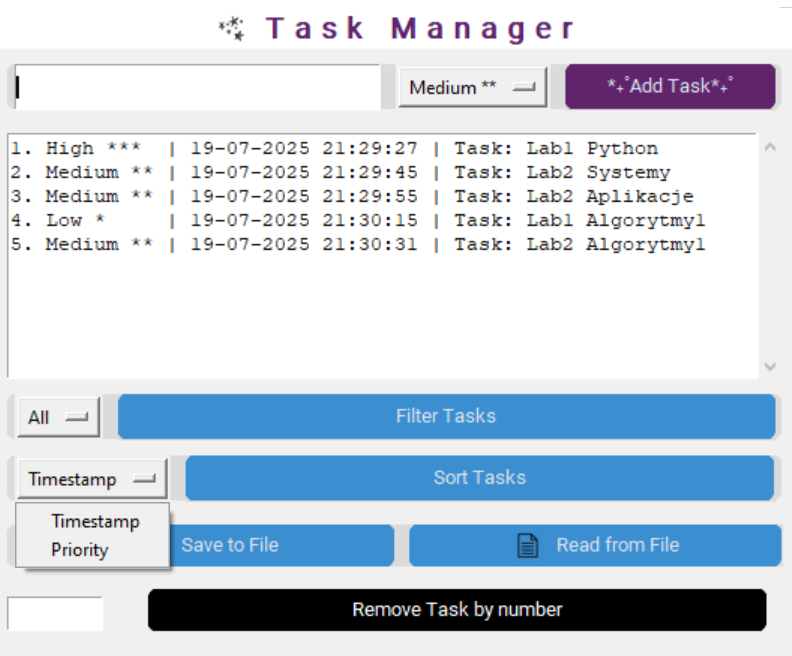
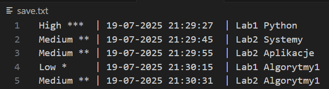
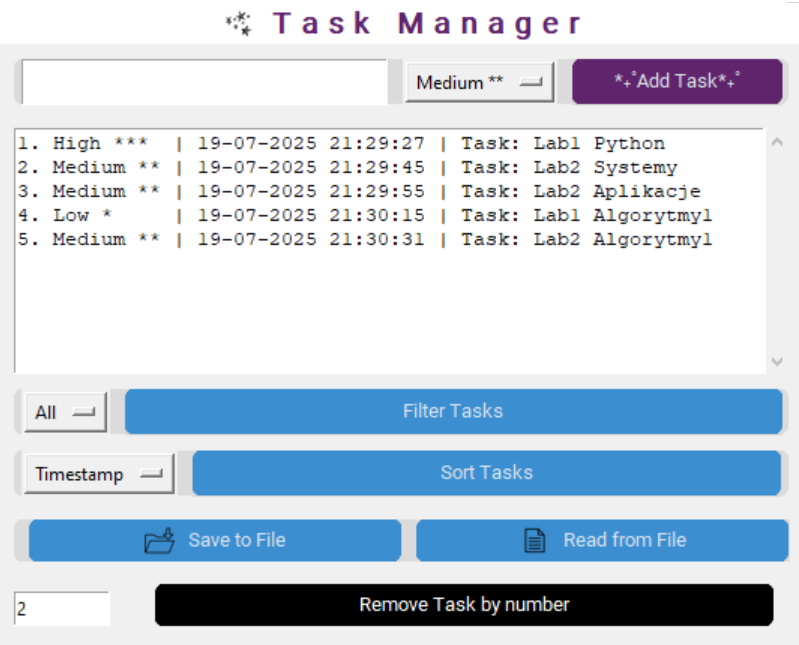
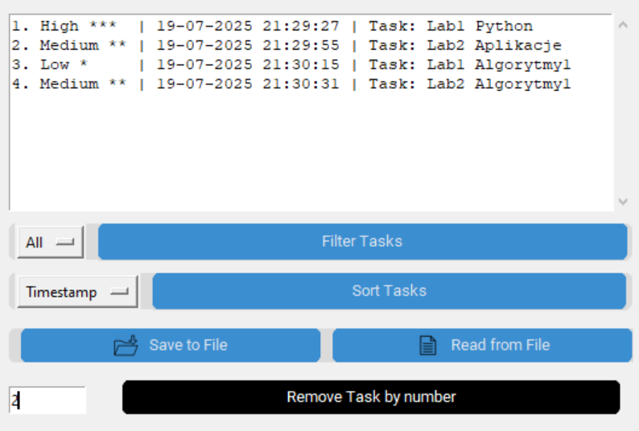

# Task Manager - Graficzny menedżer zadań
Aplikacja umożliwia dodawanie zadań z priorytetem, filtrowanie, sortowanie, usuwanie, a także zapis i odczyt listy zadań z pliku tekstowego.

**Projekt na zaliczenie z przedmiotu Python** na Zachodniopomorskim Uniwersytecie Technologicznym w roku akademickim 2023/2024.

## Autor
Martyna Kowieska

## Funkcjonalności
- Prosty interfejs graficzny z przyciskami i rozwijanymi menu.
- Dodawanie zadania z wybranym priorytetem (Low, Medium, High).
- Automatyczne nadawanie znacznika czasu (dd-mm-YYYY HH:MM:SS).
- Wyświetlanie listy ponumerowanych zadań.
- Filtrowanie zadań po priorytecie (All / Low / Medium / High).
- Sortowanie zadań według czasu dodania lub priorytetu.
- Usuwanie zadania po numerze z listy.
- Zapis wszystkich zadań do pliku tekstowego.
- Odczyt zadań z pliku i odtworzenie listy.

## Technologie
|   Technologia   |                   Zastosowanie                  |
|:---------------:|:-----------------------------------------------:|
| Python (3.9.13) | Logika aplikacji                                |
| tkinter         | Podstawowy GUI                                  |
| customtkinter   | Ulepszony wygląd widżetów                       |
| Pillow (PIL)    | Wczytywanie i skalowanie obrazów (logo / ikony) |

## Instalacja i uruchomienie
1. Sklonuj repozytorium:
   ```bash
   git clone https://github.com/mkowieska/Python_1
   cd nazwa-repozytorium
   ```

## Wygląd aplikacji
1. Panel startowy



2. Priorytetyzowanie



3. Filtrowanie




4. Sortowanie



5. Zapis do pliku



6. Usuwanie




## Struktura plików
```text
Python_1/
│
├─ Task.py               # Definicje klas Task i TaskManager
├─ main.py               # Główny punkt wejścia aplikacji
├─ images/               # Katalog na obrazy (logo, ikony)
│   ├─ img_star.jpg
│   ├─ img_save.jpg
│   └─ img_read.jpg
├─ screenshots/          # Zdjęcia menadżera zadań
│   ├─ before_deleting.png
│   ├─ deleting.png
│   ├─ filters.png
│   ├─ filters_medium.png
│   ├─ priorities.png
│   ├─ save_to_file.png
│   ├─ sorting.png
│   └─ task_manager.png 
├─ laboratoria/          # Pliki z ćwiczeń laboratoryjnych
│   ├─ lab1-Python.py 
│   ├─ lab2-Python.py 
│   ├─ lab3-Python.py
│   ├─ lab4-Python.py 
│   ├─ lab5-Python.py 
│   ├─ lab6-Python.py  
│   └─ lab7-Python.py 
└─ README.md


# Task Manager - Graphical Task Manager
This application allows you to add tasks with priority, filter, sort, and delete them, as well as save and load the task list from a text file.

**A Python final project** at the West Pomeranian University of Technology in the 2023/2024 academic year.

## Author
Martyna Kowieska

## Features
- Simple graphical interface with buttons and drop-down menus.
- Add a task with a selected priority (Low, Medium, High).
- Automatically assign a timestamp (dd-mm-YYYY HH:MM:SS).
- Display a list of numbered tasks.
- Filter tasks by priority (All / Low / Medium / High).
- Sort tasks by time added or priority.
- Delete a task by number from the list.
- Save all tasks to a text file.
- Reading tasks from a file and restoring the list.

## Technologies
| Technology | Applications |
|:---------------:|:------------------------------------------------:|
| Python (3.9.13) | Application logic |
| tkinter | Basic GUI |
| customtkinter | Improved widget appearance |
| Pillow (PIL) | Loading and resizing images (logos/icons) |

## Installation and Launch
1. Clone the repository:
   ```bash
      git clone https://github.com/mkowieska/Python_1
      cd repository-name
   ```

## Application Appearance
1. Start Panel


2. Prioritization


3. Filtering


4. Sorting


5. Saving to File


6. Deleting


## File Structure
```text
Python_1/
│
├─ Task.py                 # Task and TaskManager class definitions
├─ main.py                 # Main application entry point
├─ images/                 # Directory for images (logos, icons)
│ ├─ img_star.jpg
│ ├─ img_save.jpg
│ └─ img_read.jpg
├─ screenshots/            # Task manager screenshots
│ ├─ before_deleting.png
│ ├─ deleting.png
│ ├─ filters.png
│ ├─ filters_medium.png
│ ├─ priorities.png
│ ├─ save_to_file.png
│ ├─ sorting.png
│ └─ task_manager.png
├─ laboratories/           # Files from laboratory exercises
│ ├─ lab1-Python.py
│ ├─ lab2-Python.py
│ ├─ lab3-Python.py
│ ├─ lab4-Python.py
│ ├─ lab5-Python.py
│ ├─ lab6-Python.py
│ └─ lab7-Python.py
└─ README.md